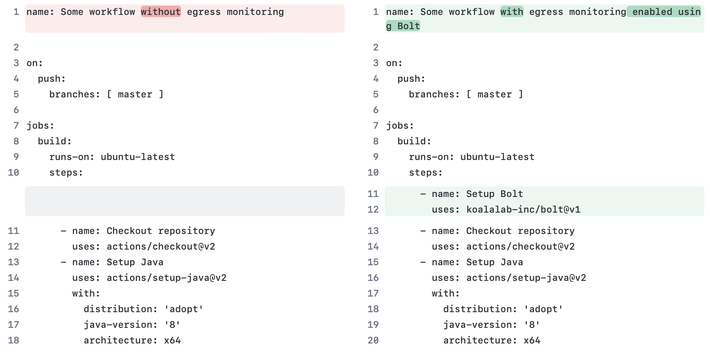

[](https://api.securityscorecards.dev/projects/github.com/koalalab-inc/bolt)


## Secure GitHub Actions with 1 line of code
Add this step to jobs in your GitHub workflow file(s) to secure your runner:
```yaml
  - name: Setup Bolt
    uses: koalalab-inc/bolt@v1
```

## Transparent Egress Gateway for GitHub hosted runners

Bolt is a transparent egress gateway that can be used to control the egress traffic from GitHub hosted runners. It is packaged as a GitHub Action, which means you can easily add it to your workflows and start controlling the egress traffic from your pipelines.

> [!NOTE]
> 
> Supports both public and private repositories


## Why?

Complex CI/CD environments are under increasing threat due to increase in software supply chain attacks. Modern CI/CDs (GitHub CI) allow third-party code in highly privledged CI environment.

GitHub hosted runners are a great way to run your CI/CD pipelines. However, they are not without their limitations. One of the most notable limitations is the lack of egress control. This means that any code running on a GitHub hosted runner can make requests to any external service. This can be a security risk, especially when running untrusted code.

## How to use Bolt - Video Introduction

https://github.com/koalalab-inc/bolt/assets/2908925/7bf51186-e673-4bed-9b56-ae15c7ab9154


## Usage
You can start using Bolt by adding the `koalalab-inc/bolt` action as the first step in the jobs you want to monitor. The action will install and start the Bolt service on the runner. Checkout the configuration options and defaults [here](#Configure).

```yaml
  - name: Setup Bolt
    uses: koalalab-inc/bolt@v1
```



## Configure
You can configuree the Bolt action using inputs. Here is an example of how to configure the action.

```yaml
  - name: Setup Bolt
    uses: koalalab-inc/bolt@v1
    with:
      mode: 'audit'
      egress_rules: |
        - name: 'Allow GitHub subs'
          destination: '*.github.com'
          action: 'allow'
      disable_passwordless_sudo: 'false'
      default_policy: 'block-all'
      allow_http: 'false'
      graceful: 'true'
```
| Option | Description  |
---------------------------------|---------------------------------
| `mode` | Configure the mode of operation for the Bolt gateway. It can be `audit` or `active`. Default: `audit` |
| `egress_rules` | A list of custom egress rules to be applied. Default: `[]`.
| `disable_passwordless_sudo` | Whether to disable passwordless sudo or not. Default: `false` |
| `allow_http` | Whether to allow non-secure HTTP requests or not. Default: `false`
| `default_policy` | It can be either `block-all` or `allow-all`. Default: `block-all` |
| `graceful` | Whether to gracefully fail in case of unsupported platforms or not. Default: `true` |

## Custom Egress Policy
You can define custom egress rules to control the egress traffic from your pipelines. Here is an example of how to define custom egress rules.

In `audit` mode, the Bolt gateway will log the egress traffic as per the defined rules. In `active` mode, the Bolt gateway will enforce the defined rules.

Egress rule options:
| Option | Description  |
---------------------------------|---------------------------------
| `name` | A name for the rule |
| `destination` | The destination domain or IP address. `*` wilcard is supported in destination. |
| `action` | The action to be taken. It can be `allow` or `block` |

It is an ordered list of rules. The first rule that matches the destination will be applied.


```yaml
  - name: Setup Bolt
    uses: koalalab-inc/bolt@v1
    with:
      mode: 'audit'
      default_policy: 'block-all'
      allow_http: 'false'
      egress_rules: |
        - name: 'Allow GitHub subdomains'
          destination: '*.github.com'
          action: 'allow'
        - name: 'Block api subdomain'
          destination: 'api.example.com'
          action: 'block'
        - name: 'Allow other subdomains'
          destination: '*.example.com'
          action: 'allow'
```

## Report
Once the job is over, bolt will add a egress traffic report to the job summary. The report will show the egress traffic and the rules that were applied. A sample report is shown below.

<hr>

<h2>⚡ Egress Report - powered by Bolt</h2>

<details open>
  <summary>
<h3>🛠️ Bolt Configuration</h3>

  </summary>
<table><tr><td>Mode</td><td>audit</td></tr><tr><td>Allow HTTP</td><td>false</td></tr><tr><td>Default Policy</td><td>block-all</td></tr></table>

</details>
    
<h3>📝 Egress rules</h3>
<pre lang="yaml"><code>- destination: google.com
  action: block
  name: Block Google
- destination: ifconfig.me
  action: allow
  name: Allow ifconfig.me</code></pre>

<h3>Egress Traffic</h3>
<blockquote>NOTE: Running in Audit mode. Unknown/unverified destinations will be blocked in Active mode.</blockquote>

<details open>
  <summary>
<h4>🚨 Unknown Destinations</h4>

  </summary>
<table><tr><th>Destination</th><th>Scheme</th><th>Rule</th><th>Action</th></tr><tr><td>www.google.com</td><td>https</td><td>Default Policy - block-all</td><td>Unknown Destination</td></tr></table>

</details>
    
<details>
  <summary>
<h4>✅ Known Destinations</h4>

  </summary>
<table><tr><th>Destination</th><th>Scheme</th><th>Rule</th><th>Action</th></tr><tr><td>github.com</td><td>https</td><td>Reqd by Github Action</td><td>✅</td></tr><tr><td>pipelinesghubeus6.actions.githubusercontent.com</td><td>https</td><td>Reqd by Github Action</td><td>✅</td></tr><tr><td>results-receiver.actions.githubusercontent.com</td><td>https</td><td>Reqd by Github Action</td><td>✅</td></tr><tr><td>ifconfig.me</td><td>https</td><td>Allow ifconfig.me</td><td>✅</td></tr><tr><td>api.github.com</td><td>https</td><td>Reqd by Github Action</td><td>✅</td></tr></table>

</details>
    <a href="https://www.koalalab.com">View detailed analysis of this run on Koalalab!</a>
<hr>

This report was generated using this workflow file: [bolt-sample.yml](examples/bolt.yml)

<hr>

> [!NOTE]
> 
> We have removed SSL inspection features from Bolt. It had some compatibility issues with certain package managers. We will soon release a new version with improved SSL inspection capabilities.